# APS MCP Server for Claude

A [Model Context Protocol](https://modelcontextprotocol.io/) (MCP) stdio server that gives **Claude Code** access to your **Autodesk Construction Cloud (ACC)** environment via the **Autodesk Platform Services (APS) API** — the REST API that underlies ACC and Forma. Manage users, audit permissions, and explore projects through plain-language conversation.

---

## Prerequisites

- Python 3.11+
- [Claude Code](https://docs.anthropic.com/en/docs/claude-code) installed
- An **APS app** with a Client ID and Client Secret ([create one here](https://aps.autodesk.com/myapps))
- An Autodesk account with **Account Admin** access to your ACC hub

---

## Authentication

The server uses **two OAuth flows**, both backed by the same APS app credentials.

### 2-legged OAuth (client credentials)

Used for account-level operations that don't require a user context: listing all account users, looking up companies, resolving user lists for bulk operations.

- **How it works:** The server exchanges your Client ID + Secret directly for an access token. No browser login required. The token is cached in memory per process.
- **Required scope:** `account:read`
- **When it's used:** `list_account_users`, `list_project_companies`

### 3-legged OAuth (user context)

Used for all project, folder, and permission operations — the API acts on behalf of *you*, the logged-in Autodesk user.

- **How it works:** On first use, a browser window opens automatically. You log in with your Autodesk account and grant consent. The token is cached in `tokens.json` and refreshed automatically. You only need to re-authorize after ~14 days of inactivity.
- **Required scopes:** `data:read`, `account:read`, `account:write` (for bulk user management tools)
- **When it's used:** All navigation, folder, and permission tools; all bulk user write operations

---

## Setting up your APS app

### 1. Create the app

1. Go to [aps.autodesk.com/myapps](https://aps.autodesk.com/myapps) and click **Create App**.
2. Under **API access**, enable:
   - Data Management API
   - ACC Account Admin API
   - BIM 360 API
3. Add `http://localhost:8080/oauth/callback` as an allowed **Callback URL**.
4. Copy your **Client ID** and **Client Secret**.

### 2. Register the app as a Custom Integration in your ACC hub

Before the app can access your hub's data, an Account Admin must register it:

1. Open **ACC** and go to **Account Admin → Custom Integrations**.
2. Click **Add Custom Integration**.
3. Enter your **Client ID** and follow the prompts to link the app to your hub.

Without this step, API calls will return 403 errors even with valid credentials.

---

## Installation

```bash
git clone https://github.com/lfcastel/Forma-MCP.git
cd Forma-MCP

python -m venv .venv

# Windows
.venv\Scripts\activate
# macOS / Linux
source .venv/bin/activate

pip install -r requirements.txt
```

---

## Configuration in Claude Code

Add the server to your Claude Code user config at `~/.claude.json`. Adjust the paths to where you cloned this repo:

```json
"mcpServers": {
  "aps": {
    "type": "stdio",
    "command": "/path/to/forma-mcp/.venv/bin/python",
    "args": ["/path/to/forma-mcp/aps_mcp.py"],
    "env": {
      "APS_CLIENT_ID": "your_client_id",
      "APS_CLIENT_SECRET": "your_client_secret"
    }
  }
}
```

**Windows paths** — use forward slashes or escaped backslashes:
```
C:/Users/YourName/Documents/forma-mcp/.venv/Scripts/python.exe
```

Restart Claude Code after saving, then run `claude mcp list` — `aps` should appear as connected.

---

## Tools reference

> **Multiple hubs on the same region?** Every tool accepts an optional `hub_name` parameter (partial match, case-insensitive). Pass it whenever your account has more than one EMEA hub and you need to target a specific one — e.g. `hub_name: "BAC - EU Hub"`. Without it, the first hub returned for the region is used.

### Navigation & file exploration

| Tool | What it does | Auth |
|------|-------------|------|
| `list_hubs` | List all ACC / BIM360 hubs on your account | 3-legged |
| `list_projects` | List all projects in a hub | 3-legged |
| `list_top_folders` | List top-level folders in a project | 3-legged |
| `list_folder_contents` | List files and subfolders at a given path | 3-legged |
| `rename_folder` | Rename a folder by its display-name path | 3-legged |
| `rename_file` | Rename a file by creating a new version (no re-upload) | 3-legged |
| `create_folder` | Create a new folder inside an existing parent folder | 3-legged |
| `move_file` | Move a file into another folder (changes its parent; no re-upload) | 3-legged |
| `move_folder` | Move a folder (and its contents) into another parent folder | 3-legged |
| `find_files` | Search for files by name across a project | 3-legged |
| `find_folder` | Search for folders by name across a project | 3-legged |
| `delete_folder` | Soft-delete (hide) an empty folder | 3-legged |
| `find_recent_activity` | Show files modified since a given date | 3-legged |

### User & member management

| Tool | What it does | Auth |
|------|-------------|------|
| `list_project_members` | List all members of a project with their roles | 3-legged |
| `list_account_users` | List all users in the ACC account | 2-legged |
| `list_project_roles` | List all roles defined in a project | 3-legged |
| `list_project_companies` | List companies linked to a project | 2-legged |

### Permissions

| Tool | What it does | Auth |
|------|-------------|------|
| `export_permission_matrix` | Export a full permission matrix for a folder tree | 3-legged |
| `apply_permission_changes` | Apply batched permission changes to folders | 3-legged |

### Role & data export

| Tool | What it does | Auth |
|------|-------------|------|
| `create_role_data_export` | Trigger a Data Connector export for role/user data | 3-legged |
| `get_data_connector_requests` | List and download completed Data Connector exports | 3-legged |

### Bulk user management

All five bulk tools default to **`dry_run: true`** — Claude always shows a preview before making any changes. A timestamped audit CSV (`audit_<operation>_<timestamp>.csv`) is written on every live execution.

| Tool | What it does | Auth |
|------|-------------|------|
| `bulk_assign_users` | Add a list of users to one or more projects with specified roles | 3-legged + `account:write` |
| `update_user_roles` | Update the role of existing project members | 3-legged + `account:write` |
| `remove_users_from_projects` | Remove users from one or more projects | 3-legged + `account:write` |
| `clone_user_access` | Copy one user's full project access to another user | 3-legged + `account:write` |
| `bulk_assign_company_users` | Add all members of an ACC company to a project | 3-legged + `account:write` |

### Bulk folder operations

Three composable primitives for reorganising folder structures at scale (e.g. standardising the subfolders across hundreds of building folders in one project). They are deliberately **dumb and general** — a Claude instance does the orchestration and judgment (audit → decide what to create/delete → surface anomalies and stuck files); no reorg policy is baked into the tools. The two mutating tools default to **`dry_run: true`**.

| Tool | What it does | Auth |
|------|-------------|------|
| `bulk_list_folder_contents` | Audit engine (read-only): list the immediate contents of many folders — or of every subfolder of one parent — in a single call, returning subfolders (name + id) and files | 3-legged |
| `bulk_create_folders` | Idempotent batch create: `{parent, name}` items; `skip_if_exists` (default) reports `exists` instead of duplicating | 3-legged |
| `bulk_delete_folders` | File-safe batch soft-delete: never deletes a folder with any file in its subtree — reports it as `skipped_has_files` with `file_count` + `sample_files` | 3-legged |
| `bulk_move_files` | Batch-move files into new folders (no re-upload); idempotent (`already_there`); C4R models that 403 are reported `skipped_unmovable` | 3-legged |
| `bulk_move_folders` | Batch-move folders (with contents) under new parents; idempotent (`already_there`) | 3-legged |

> **File safety is absolute.** `bulk_delete_folders` applies the same subtree-file check as the single `delete_folder` and only ever soft-deletes (admin-reversible). The `skipped_has_files` rows are the "stuck files" (typically cloud-workshared Revit/C4R models the API can't move) for a human to relocate in the ACC UI. Both mutating tools support `continue_on_error` (default true), a `max_concurrency` cap (default 8), and survive a mid-batch token expiry (a 401 triggers a one-time token refresh).

#### Output verbosity — `response_detail`

`bulk_move_files`, `bulk_move_folders`, `bulk_delete_folders`, and `bulk_list_folder_contents` take a `response_detail` parameter that shapes the returned `results` array **without changing what the tool does** (the `summary` counts are always computed before filtering and stay accurate at every level):

| Value | Returns |
|-------|---------|
| `full` | Every row (legacy behaviour — nothing dropped). |
| `changes` *(default)* | Summary + only the rows that need attention — moves keep `error` / `skipped_unmovable` / `not_found`; deletes keep `skipped_has_files` / `error`; the audit keeps only folders with files or subfolders. The success/no-op noise (`moved`, `already_there`, `deleted`, empty folders) is dropped. |
| `summary` | Only the summary counts — the per-item `results` array is omitted. **Failures are never lost:** any locked/unmovable/stuck row is still surfaced under a small `failures` array (and the audit's separate `errors` array is always present). |

`changes` is the default because in a typical batch almost everything succeeds silently and only the locked/conflict cases need action — returning just those is the bulk of the token saving. Pass `response_detail: "full"` to get the old echo-everything behaviour.

> **Lean audits — `fields`.** `bulk_list_folder_contents` also takes `fields: ["files", "subfolders"]` to restrict each folder row to just those sections. When `fields` is given, file entries are returned **lean** (`id` + `name` only, dropping `last_modified` / `created_by`) — ideal when you only need URNs to feed straight into a `bulk_move_files` call.

---

## Tools & API endpoints

All tools grouped by function, with the APS API endpoints each one calls.

```mermaid
flowchart LR
    classDef tool fill:#F0F4FF,stroke:#6C8EBF,color:#333
    classDef get fill:#1A6FAF,stroke:#145A8B,color:#fff
    classDef post fill:#1E7E34,stroke:#155724,color:#fff
    classDef patch fill:#E67E22,stroke:#CA6F1E,color:#fff
    classDef del fill:#C0392B,stroke:#962D22,color:#fff

    subgraph NAV["Navigation & Files · 3-legged OAuth"]
        T1(list_hubs)
        T2(list_projects)
        T3(list_top_folders)
        T4(list_folder_contents)
        T20(rename_folder)
        T21(rename_file)
        T22(create_folder)
        T25(move_file)
        T26(move_folder)
        T5(find_recent_activity)
        T6(find_files)
        T23(find_folder)
        T24(delete_folder)
    end

    subgraph UMEM["User & Member Info · 3-legged + 2-legged"]
        T7(list_project_members)
        T8(list_account_users)
        T9(list_project_roles)
        T10(list_project_companies)
    end

    subgraph PERMS["Permissions · 3-legged OAuth"]
        T11(export_permission_matrix)
        T12(apply_permission_changes)
    end

    subgraph ROLES["Role Export · 3-legged OAuth"]
        T13(create_role_data_export)
        T14(get_data_connector_requests)
    end

    subgraph BULK["Bulk User Management · 3-legged + account:write · dry_run=true by default"]
        T15(bulk_assign_users)
        T16(update_user_roles)
        T17(remove_users_from_projects)
        T18(clone_user_access)
        T19(bulk_assign_company_users)
    end

    subgraph BULKF["Bulk Folder Ops · 3-legged OAuth · dry_run=true by default"]
        T27(bulk_list_folder_contents)
        T28(bulk_create_folders)
        T29(bulk_delete_folders)
        T30(bulk_move_files)
        T31(bulk_move_folders)
    end

    E1["GET /project/v1/hubs"]
    E2["GET /project/v1/hubs/{hub}/projects"]
    E3["GET /project/v1/.../projects/{p}/topFolders"]
    E4["GET /data/v1/projects/{p}/folders/{f}/contents"]
    E5["GET /construction/admin/v1/projects/{p}/users"]
    E6["GET /hq/v1/accounts/{a}/users"]
    E7["GET /projects/{p}/users"]
    E8["GET /hq/v1/accounts/{a}/projects/{p}/companies"]
    E9["GET /bim360/docs/v1/.../folders/{f}/permissions"]
    E10["POST .../permissions:batch-create"]
    E11["POST .../permissions:batch-delete"]
    E12["POST /data-connector/v1/accounts/{a}/requests"]
    E13["GET .../requests/{r}/jobs + ZIP download"]
    E14["POST /construction/admin/v2/projects/{p}/users:import"]
    E15["PATCH /construction/admin/v1/projects/{p}/users/{u}"]
    E16["DELETE /construction/admin/v1/projects/{p}/users/{u}"]
    E17["PATCH /data/v1/projects/{p}/folders/{f}"]
    E18["POST /data/v1/projects/{p}/versions?copyFrom=..."]
    E19["POST /data/v1/projects/{p}/folders"]
    E20["PATCH /data/v1/projects/{p}/items/{i}"]

    T1 --> E1
    T2 --> E2
    T3 --> E3
    T4 --> E4
    T20 --> E17
    T21 --> E18
    T22 --> E19
    T25 --> E20
    T26 --> E17
    T5 --> E4
    T6 --> E4
    T23 --> E4
    T24 --> E17

    T7 --> E5
    T7 --> E6
    T8 --> E6
    T9 --> E7
    T10 --> E8

    T11 --> E9
    T12 --> E10
    T12 --> E11

    T13 --> E12
    T14 --> E13

    T15 --> E14
    T16 --> E15
    T17 --> E16
    T18 --> E5
    T18 --> E14
    T19 --> E6
    T19 --> E14

    T27 --> E4
    T28 --> E4
    T28 --> E19
    T29 --> E4
    T29 --> E17
    T30 --> E4
    T30 --> E20
    T31 --> E4
    T31 --> E17

    class T1,T2,T3,T4,T5,T6,T7,T8,T9,T10,T11,T12,T13,T14,T15,T16,T17,T18,T19,T20,T21,T22,T23,T24,T25,T26,T27,T28,T29,T30,T31 tool
    class E1,E2,E3,E4,E5,E6,E7,E8,E9,E13 get
    class E10,E11,E12,E14,E18,E19 post
    class E15,E17,E20 patch
    class E16 del
```



| Colour | HTTP method |
|--------|------------|
| Blue | GET — read only |
| Green | POST — create / bulk import |
| Orange | PATCH — update |
| Red | DELETE — remove |
| Light blue | MCP tool node |

---

## Example prompts

### Navigation & search

```
List all my ACC hubs
Show all projects in my hub
Show all projects in the "BAC - EU Hub" hub
What are the top folders in "Northgate Tower"?
List the contents of Project Files/Drawings/Structural in "Northgate Tower"
List the contents of Project Files/Drawings in "Northgate Tower" in hub "BAC - EU Hub"
Find all files named "facade" in "Northgate Tower"
What files were modified in the last 7 days in "Northgate Tower"?
```

### User & access management

```
Who are the members of the "Riverside Bridge" project?
List all users in the account who work for Acme Engineering
What roles exist in the "Central Station" project?
```

### Bulk operations (always previewed before execution)

```
Add all users from company Acme Engineering to the "Northgate Tower" project as Design Team members
Clone the project access of john.doe@example.com to jane.smith@example.com
Remove alice@contractor.com from all projects she's a member of
Update the role of all Acme Engineering members in "Central Station" to Viewer
Show me a dry run of adding Acme Engineering to the "Riverside Bridge" project
```

### Bulk folder reorg (always previewed before execution)

```
Audit every building folder under Project Files in "AS-IS Buildings" (children_of, regex ^B-B-)
For each building, create the missing standard subfolders and delete the empty legacy ones — dry run first
Delete the legacy 0. WIP / 1. SHARED / 2. PUBLISHED / 3. ARCHIVED folders, but skip any that still hold files
Move every file out of each building's 0. WIP into its User A folder, then delete the empty WIP folders
Move the B-B-7xx building folders under Project Files/Archive
Re-run the create + delete as a dry run to prove the reorg is idempotent (zero would-change rows)
```

### Permission auditing

```
Export the full permission matrix for Project Files in "Northgate Tower"
```

---

## Security & credentials

- **3-legged OAuth** — the user token is cached in `tokens.json` after your first browser login. This file is listed in `.gitignore` — never commit it.
- **2-legged OAuth** — uses your APS Client ID and Secret (stored in `~/.claude.json`, Claude Code's config). The token is derived from these credentials at runtime and cached **in memory only** — it is never written to disk.
- Each user authenticates with **their own Autodesk account** via 3-legged OAuth. The server acts with their permissions, not with elevated app-level rights.
- Bulk write tools default to `dry_run: true` — no changes are made without explicit confirmation.

---

## Troubleshooting

| Symptom | Likely cause | Fix |
|---------|-------------|-----|
| 403 on any API call | App not registered as Custom Integration in the hub | Account Admin must add it via **ACC Account Admin → Custom Integrations** |
| 403 on folder or permission calls | Token expired | Delete `tokens.json` to force re-login |
| MCP server not listed | Config path wrong or venv not set up | Run `claude mcp list`; check paths in `~/.claude.json` |
| Browser doesn't open for login | Port 8080 already in use | Free up port 8080 and retry |
| Company not found | Not yet added to ACC account | Account Admin must add it via **ACC Account Admin → Companies** |
| Company not in project | Added to account but not linked to project | Project Admin adds it via **ACC Admin → Project Admin → Companies** |

---

## Known Limitations

- **User last-activity date** — the `last_sign_in` field is only populated for **BIM360 projects**. The underlying ACC Account Admin API does not return this field for Forma projects, so activity timestamps will be absent for those users.
- **APS rate / quota limits** — Autodesk enforces per-app API quotas. When one is hit, a tool returns a clean `quota_exceeded` result (HTTP 429) with the `Retry-After` hint instead of hanging — wait the suggested time and retry. Transient rate spikes are retried automatically a few times with a short back-off; only a persistent quota error surfaces to you.
- **Cloud-workshared Revit models can't be moved by API** — C4R models (`C4RModel`) return 403 on a move and cannot be relocated programmatically. During a `bulk_delete_folders` reorg they are what keeps a folder from being deleted: it is reported as `skipped_has_files` so a human can move them in the Revit/ACC UI first.

---

## License

Licensed under the [GNU Lesser General Public License v3.0](https://www.gnu.org/licenses/lgpl-3.0.html) (LGPL-3.0).

---

## Contributing

```bash
git clone https://github.com/lfcastel/Forma-MCP.git
cd Forma-MCP
python -m venv .venv && .venv\Scripts\activate   # Windows
pip install -r requirements.txt
python -m pytest tests/ -v                        # all tests must pass before pushing
```

All changes go through a pull request. GitHub Actions runs the test suite automatically on every PR — the PR cannot be merged until CI is green.

> **One-time repo setup (owner only):** after the first CI run completes, go to **Settings → Branches → Add rule** for `main`, tick *Require status checks to pass*, and select the `test` job.

## Repository layout

```
forma-mcp/
├── aps_mcp.py                  # MCP server — 31 tools
├── tests/                      # pytest test suite
├── .github/workflows/ci.yml    # GitHub Actions CI
├── requirements.txt
├── README.md
└── .gitignore
```
