# APS MCP Server for Claude

A [Model Context Protocol](https://modelcontextprotocol.io/) (MCP) stdio server that gives **Claude Code** access to your **Autodesk Construction Cloud (ACC)** environment via the **Autodesk Platform Services (APS) API** — the REST API that underlies ACC and Forma. Manage users, audit permissions, and explore projects through plain-language conversation.

---

## Prerequisites

- Python 3.11+
- [Claude Code](https://docs.anthropic.com/en/docs/claude-code) installed
- An **APS app** with a Client ID and Client Secret ([create one here](https://aps.autodesk.com/myapps))
- An Autodesk account with **Account Admin** access to your ACC hub

---

## Authentication

The server uses **two OAuth flows**, both backed by the same APS app credentials.

### 2-legged OAuth (client credentials)

Used for account-level operations that don't require a user context: listing all account users, looking up companies, resolving user lists for bulk operations.

- **How it works:** The server exchanges your Client ID + Secret directly for an access token. No browser login required. The token is cached in memory per process.
- **Required scope:** `account:read`
- **When it's used:** `list_account_users`, `list_project_companies`, `list_account_companies`, and the hub-directory write tools (`bulk_add_hub_users`, `bulk_add_hub_companies`, `deactivate_hub_users`, `deactivate_hub_companies`)

### 3-legged OAuth (user context)

Used for all project, folder, and permission operations — the API acts on behalf of *you*, the logged-in Autodesk user.

- **How it works:** On first use, a browser window opens automatically. You log in with your Autodesk account and grant consent. The token is cached in `tokens.json` and refreshed automatically. You only need to re-authorize after ~14 days of inactivity.
- **Required scopes:** `data:read`, `account:read`, `account:write` (for bulk user management tools)
- **When it's used:** All navigation, folder, and permission tools; all bulk user write operations

---

## Setting up your APS app

### 1. Create the app

1. Go to [aps.autodesk.com/myapps](https://aps.autodesk.com/myapps) and click **Create App**.
2. Under **API access**, enable:
   - Data Management API
   - ACC Account Admin API
   - BIM 360 API
3. Add `http://localhost:8080/oauth/callback` as an allowed **Callback URL**.
4. Copy your **Client ID** and **Client Secret**.

### 2. Register the app as a Custom Integration in your ACC hub

Before the app can access your hub's data, an Account Admin must register it:

1. Open **ACC** and go to **Account Admin → Custom Integrations**.
2. Click **Add Custom Integration**.
3. Enter your **Client ID** and follow the prompts to link the app to your hub.

Without this step, API calls will return 403 errors even with valid credentials.

---

## Installation

```bash
git clone https://github.com/lfcastel/Forma-MCP.git
cd Forma-MCP

python -m venv .venv

# Windows
.venv\Scripts\activate
# macOS / Linux
source .venv/bin/activate

pip install -r requirements.txt
```

---

## Configuration in Claude Code

Add the server to your Claude Code user config at `~/.claude.json`. Adjust the paths to where you cloned this repo:

```json
"mcpServers": {
  "aps": {
    "type": "stdio",
    "command": "/path/to/forma-mcp/.venv/bin/python",
    "args": ["/path/to/forma-mcp/aps_mcp.py"],
    "env": {
      "APS_CLIENT_ID": "your_client_id",
      "APS_CLIENT_SECRET": "your_client_secret",
      "APS_ROLE_CACHE": "/path/to/role_id_cache.json"
    }
  }
}
```

`APS_ROLE_CACHE` (optional) points at a `role_id_cache.json` mapping every hub role **name → UUID**, so you can assign a role **by name even when no member holds it yet** (an unused role is otherwise invisible — ACC has no project-roles catalog API). Without the env var the server also looks for `role_id_cache.json` next to `aps_mcp.py`, then under `~/.claude/skills/aps/`. Build/refresh the file from a Data Connector export (`create_role_data_export` → `get_data_connector_requests`). It contains real role UUIDs, so it's **gitignored** — keep it local.

**Windows paths** — use forward slashes or escaped backslashes:
```
C:/Users/YourName/Documents/forma-mcp/.venv/Scripts/python.exe
```

Restart Claude Code after saving, then run `claude mcp list` — `aps` should appear as connected.

---

## Tools reference

### Navigation & file exploration

| Tool | What it does | Auth |
|------|-------------|------|
| `list_hubs` | List all ACC / BIM360 hubs on your account | 3-legged |
| `list_projects` | List all projects in a hub | 3-legged |
| `resolve_project` | Resolve a project from a name, ID (`b.xxx`/bare UUID), or ACC URL → project + owning hub in one call | 2-legged (ID/URL) / 3-legged (name) |
| `list_top_folders` | List top-level folders in a project | 3-legged |
| `list_folder_contents` | List files and subfolders at a given path | 3-legged |
| `rename_folder` | Rename a folder by its display-name path | 3-legged |
| `rename_file` | Rename a file by creating a new version (no re-upload) | 3-legged |
| `create_folder` | Create a new folder inside an existing parent folder | 3-legged |
| `move_file` | Move a file into another folder (changes its parent; no re-upload) | 3-legged |
| `move_folder` | Move a folder (and its contents) into another parent folder | 3-legged |
| `find_files` | Search for files by name across a project | 3-legged |
| `list_all_files` | Recursively list **every** file in a project (or a folder + subfolders) with full paths | 3-legged |
| `export_deliverables_manifest` | Compact **filename-only** recursive list (deduped, sorted, no metadata) for cross-checking against an external deliverable list | 3-legged |
| `find_folder` | Search for folders by name across a project | 3-legged |
| `delete_folder` | Soft-delete (hide) an empty folder | 3-legged |
| `find_recent_activity` | Show files modified since a given date | 3-legged |

### User & member management

| Tool | What it does | Auth |
|------|-------------|------|
| `list_project_members` | List all members of a project with their roles | 3-legged |
| `list_account_users` | List all users in the ACC account | 2-legged |
| `list_project_roles` | List all roles defined in a project | 3-legged |
| `list_project_companies` | List companies linked to a project | 2-legged |
| `list_account_companies` | List every company in the hub's directory (account-level) with id, trade, status | 2-legged |

### Permissions

| Tool | What it does | Auth |
|------|-------------|------|
| `export_permission_matrix` | Export a full permission matrix for a folder tree | 3-legged |
| `apply_permission_changes` | Apply batched permission changes to folders | 3-legged |

### Role & data export

| Tool | What it does | Auth |
|------|-------------|------|
| `create_role_data_export` | Trigger a Data Connector `admin` export to resolve the full project-roles catalog (id ↔ name, **empty roles included**) — for assigning users to an unused role or labelling `export_permission_matrix` | 3-legged |
| `get_data_connector_requests` | Poll & download a completed Data Connector export; returns the `role_id → name` map | 3-legged |

### Bulk user management

| Tool | What it does | Auth |
|------|-------------|------|
| `bulk_assign_users` | Add a list of users to one or more projects with specified role(s) | 3-legged + `account:write` |
| `update_user_roles` | Update the role(s) of existing project members | 3-legged + `account:write` |
| `remove_users_from_projects` | Remove users from one or more projects | 3-legged + `account:write` |
| `clone_user_access` | Copy one user's full project access (all roles) to another user | 3-legged + `account:write` |
| `bulk_assign_company_users` | Add all members of an ACC company to a project | 3-legged + `account:write` |

### Hub-level directory & onboarding

| Tool | What it does | Auth |
|------|-------------|------|
| `bulk_add_hub_users` | Onboard users to the hub in bulk, each with a company (required) + optional default role; idempotent (`already_exists`) | 2-legged (`account:write`) |
| `bulk_add_hub_companies` | Import partner companies into the hub directory (name + trade required); idempotent (`already_exists`) | 2-legged (`account:write`) |
| `deactivate_hub_users` | Soft-offboard hub users (`status: inactive`; the API has no hard delete) | 2-legged (`account:write`) |
| `deactivate_hub_companies` | Deactivate companies in the hub directory (`status: inactive`) | 2-legged (`account:write`) |

### Bulk folder operations

| Tool | What it does | Auth |
|------|-------------|------|
| `bulk_list_folder_contents` | Audit engine (read-only): list the immediate contents of many folders — or of every subfolder of one parent — in a single call, returning subfolders (name + id) and files | 3-legged |
| `audit_folder_naming_standards` | Naming-convention audit (read-only): walk a folder subtree (or the whole project) and report which naming standard each folder enforces, grouped by standard, and flag the folders with none | 3-legged |
| `bulk_create_folders` | Idempotent batch create: `{parent, name}` items; `skip_if_exists` (default) reports `exists` instead of duplicating | 3-legged |
| `bulk_delete_folders` | File-safe batch soft-delete: never deletes a folder with any file in its subtree — reports it as `skipped_has_files` with `file_count` + `sample_files` | 3-legged |
| `bulk_move_files` | Batch-move files into new folders (no re-upload); idempotent (`already_there`); C4R models that 403 are reported `skipped_unmovable` | 3-legged |
| `bulk_move_folders` | Batch-move folders (with contents) under new parents; idempotent (`already_there`) | 3-legged |

#### Output verbosity — `response_detail`

| Value | Returns |
|-------|---------|
| `full` | Every row (legacy behaviour — nothing dropped). |
| `changes` *(default)* | Summary + only the rows that need attention — moves keep `error` / `skipped_unmovable` / `not_found`; deletes keep `skipped_has_files` / `error`; the contents audit keeps only folders with files or subfolders; the naming-standards audit keeps only folders with no standard. The success/no-op noise (`moved`, `already_there`, `deleted`, empty folders, folders that already have a standard) is dropped. |
| `summary` | Only the summary counts — the per-item `results` array is omitted. **Failures are never lost:** any locked/unmovable/stuck row (or no-standard folder) is still surfaced under a small `failures` array (and the contents audit's separate `errors` array is always present). |

### Issues

| Tool | What it does | Auth |
|------|-------------|------|
| `list_issues` | List issues (pushpin + general) with common filters (status, search, assignee, dates, type/subtype, linked file URN, deleted); auto-paginates; `fields` slims each row | 3-legged |
| `get_issue` | Get one issue by `issue_id` (UUID) or `display_id` (the friendly number) | 3-legged |
| `create_issue` | Create an issue — requires `title`, `issue_subtype_id`, `status`; posts immediately | 3-legged (`data:write`) |
| `update_issue` | Update an issue (edit fields, change status, reassign) by `issue_id`/`display_id`; posts only the fields you supply | 3-legged (`data:write`) |
| `list_issue_types` | List issue categories + their types (subtypes) with 3-char codes — source of a valid `issue_subtype_id` and the key to decode type UUIDs | 3-legged |
| `list_issue_attribute_definitions` | List project custom fields (id, title, dataType, dropdown options) | 3-legged |
| `list_issue_attribute_mappings` | List which custom fields are assigned to which categories/types | 3-legged |

---

### Approval workflows

| Tool | What it does | Auth |
|------|-------------|------|
| `list_workflows` | List approval workflows; filter by `status` (ACTIVE default / INACTIVE) or `initiator`; `sort`; auto-paginates | 3-legged |
| `get_workflow` | Get one workflow by `workflow_id` (UUID) or `name` | 3-legged |
| `create_workflow` | Create a workflow — `name` + `steps` required; posts immediately (no `dry_run`) | 3-legged (`data:write`) |
| `bulk_create_workflows` | Create many workflows from a list of specs (the Excel batch); `dry_run` default, audit CSV, bounded concurrency, per-row results | 3-legged (`data:write`) |

---

## Tools & API endpoints

All tools grouped by function, with the APS API endpoints each one calls.

```mermaid
flowchart LR
    classDef tool fill:#F0F4FF,stroke:#6C8EBF,color:#333
    classDef get fill:#1A6FAF,stroke:#145A8B,color:#fff
    classDef post fill:#1E7E34,stroke:#155724,color:#fff
    classDef patch fill:#E67E22,stroke:#CA6F1E,color:#fff
    classDef del fill:#C0392B,stroke:#962D22,color:#fff

    subgraph NAV["Navigation & Files · 3-legged OAuth"]
        T1(list_hubs)
        T2(list_projects)
        T38(resolve_project)
        T3(list_top_folders)
        T4(list_folder_contents)
        T20(rename_folder)
        T21(rename_file)
        T22(create_folder)
        T25(move_file)
        T26(move_folder)
        T5(find_recent_activity)
        T6(find_files)
        T39(list_all_files)
        T40(export_deliverables_manifest)
        T23(find_folder)
        T24(delete_folder)
    end

    subgraph UMEM["User & Member Info · 3-legged + 2-legged"]
        T7(list_project_members)
        T8(list_account_users)
        T9(list_project_roles)
        T10(list_project_companies)
        T33(list_account_companies)
    end

    subgraph PERMS["Permissions · 3-legged OAuth"]
        T11(export_permission_matrix)
        T12(apply_permission_changes)
    end

    subgraph ROLES["Role Export · 3-legged OAuth"]
        T13(create_role_data_export)
        T14(get_data_connector_requests)
    end

    subgraph BULK["Bulk User Management · 3-legged + account:write · dry_run=true by default"]
        T15(bulk_assign_users)
        T16(update_user_roles)
        T17(remove_users_from_projects)
        T18(clone_user_access)
        T19(bulk_assign_company_users)
    end

    subgraph HUBDIR["Hub Directory & Onboarding · 2-legged account:write · dry_run=true by default"]
        T34(bulk_add_hub_users)
        T35(bulk_add_hub_companies)
        T36(deactivate_hub_users)
        T37(deactivate_hub_companies)
    end

    subgraph BULKF["Bulk Folder Ops · 3-legged OAuth · dry_run=true by default"]
        T27(bulk_list_folder_contents)
        T28(bulk_create_folders)
        T29(bulk_delete_folders)
        T30(bulk_move_files)
        T31(bulk_move_folders)
        T32(audit_folder_naming_standards)
    end

    subgraph ISSUES["Issues · 3-legged OAuth · x-ads-region: EMEA"]
        T41(list_issues)
        T42(create_issue)
        T43(list_issue_types)
        T44(list_issue_attribute_definitions)
        T45(list_issue_attribute_mappings)
        T46(get_issue)
        T47(update_issue)
    end

    subgraph WORKFLOWS["Approval workflows · Reviews · 3-legged OAuth · x-ads-region: EMEA"]
        T48(list_workflows)
        T49(get_workflow)
        T50(create_workflow)
        T51(bulk_create_workflows)
    end

    E1["GET /project/v1/hubs"]
    E2["GET /project/v1/hubs/{hub}/projects"]
    E3["GET /project/v1/.../projects/{p}/topFolders"]
    E4["GET /data/v1/projects/{p}/folders/{f}/contents"]
    E5["GET /construction/admin/v1/projects/{p}/users"]
    E6["GET /hq/v1/accounts/{a}/users"]
    E7["GET /projects/{p}/users"]
    E8["GET /hq/v1/accounts/{a}/projects/{p}/companies"]
    E9["GET /bim360/docs/v1/.../folders/{f}/permissions"]
    E10["POST .../permissions:batch-create"]
    E11["POST .../permissions:batch-delete"]
    E12["POST /data-connector/v1/accounts/{a}/requests"]
    E13["GET .../requests/{r}/jobs + ZIP download"]
    E14["POST /construction/admin/v2/projects/{p}/users:import"]
    E15["PATCH /construction/admin/v1/projects/{p}/users/{u}"]
    E16["DELETE /construction/admin/v1/projects/{p}/users/{u}"]
    E17["PATCH /data/v1/projects/{p}/folders/{f}"]
    E18["POST /data/v1/projects/{p}/versions?copyFrom=..."]
    E19["POST /data/v1/projects/{p}/folders"]
    E20["PATCH /data/v1/projects/{p}/items/{i}"]
    E21["GET /data/v1/projects/{p}/folders/{f}"]
    E22["GET /construction/admin/v1/accounts/{a}/companies"]
    E23["POST /hq/v1/accounts/{a}/users/import"]
    E24["POST /hq/v1/accounts/{a}/companies/import"]
    E25["PATCH /hq/v1/accounts/{a}/users/{u}"]
    E26["PATCH /hq/v1/accounts/{a}/companies/{c}"]
    E27["GET /construction/admin/v1/projects/{p}?fields=accountId,name,platform"]
    E28["GET /construction/issues/v1/projects/{p}/issues"]
    E29["POST /construction/issues/v1/projects/{p}/issues"]
    E30["GET /construction/issues/v1/projects/{p}/issue-types"]
    E31["GET /construction/issues/v1/projects/{p}/issue-attribute-definitions"]
    E32["GET /construction/issues/v1/projects/{p}/issue-attribute-mappings"]
    E33["GET /construction/issues/v1/projects/{p}/issues/{i}"]
    E34["PATCH /construction/issues/v1/projects/{p}/issues/{i}"]
    E35["GET /construction/reviews/v1/projects/{p}/workflows"]
    E36["GET /construction/reviews/v1/projects/{p}/workflows/{w}"]
    E37["POST /construction/reviews/v1/projects/{p}/workflows"]

    T1 --> E1
    T2 --> E2
    T38 --> E27
    T38 --> E1
    T38 --> E2
    T3 --> E3
    T4 --> E4
    T20 --> E17
    T21 --> E18
    T22 --> E19
    T25 --> E20
    T26 --> E17
    T5 --> E4
    T6 --> E4
    T39 --> E3
    T39 --> E4
    T40 --> E3
    T40 --> E4
    T23 --> E4
    T24 --> E17

    T7 --> E5
    T7 --> E6
    T8 --> E6
    T9 --> E7
    T10 --> E8

    T11 --> E9
    T12 --> E10
    T12 --> E11

    T13 --> E12
    T14 --> E13

    T15 --> E5
    T15 --> E14
    T16 --> E15
    T17 --> E16
    T18 --> E5
    T18 --> E14
    T19 --> E5
    T19 --> E6
    T19 --> E14

    T33 --> E22
    T34 --> E22
    T34 --> E6
    T34 --> E23
    T35 --> E22
    T35 --> E24
    T36 --> E6
    T36 --> E25
    T37 --> E22
    T37 --> E26

    T27 --> E4
    T28 --> E4
    T28 --> E19
    T29 --> E4
    T29 --> E17
    T30 --> E4
    T30 --> E20
    T31 --> E4
    T31 --> E17
    T32 --> E3
    T32 --> E4
    T32 --> E21

    T41 --> E28
    T42 --> E29
    T43 --> E30
    T44 --> E31
    T45 --> E32
    T46 --> E33
    T47 --> E34

    T48 --> E35
    T49 --> E35
    T49 --> E36
    T50 --> E37
    T50 --> E5
    T50 --> E8
    T51 --> E37
    T51 --> E5
    T51 --> E8

    class T1,T2,T3,T4,T5,T6,T7,T8,T9,T10,T11,T12,T13,T14,T15,T16,T17,T18,T19,T20,T21,T22,T23,T24,T25,T26,T27,T28,T29,T30,T31,T32,T33,T34,T35,T36,T37,T38,T39,T40,T41,T42,T43,T44,T45,T46,T47,T48,T49,T50,T51 tool
    class E1,E2,E3,E4,E5,E6,E7,E8,E9,E13,E21,E22,E27,E28,E30,E31,E32,E33,E35,E36 get
    class E10,E11,E12,E14,E18,E19,E23,E24,E29,E37 post
    class E15,E17,E20,E25,E26,E34 patch
    class E16 del
```



| Colour | HTTP method |
|--------|------------|
| Blue | GET — read only |
| Green | POST — create / bulk import |
| Orange | PATCH — update |
| Red | DELETE — remove |
| Light blue | MCP tool node |

---

## Example prompts

### Navigation & search

```
List all my ACC hubs
Show all projects in my hub
Show all projects in the "My Company - EU Hub" hub
Resolve https://acc.autodesk.eu/docs/files/projects/<project-id> — which hub is it in?
List the top folders of project b.<project-id> (paste the ID, no hub name needed)
What are the top folders in "Northgate Tower"?
List the contents of Project Files/Drawings/Structural in "Northgate Tower"
List the contents of Project Files/Drawings in "Northgate Tower" in hub "My Company - EU Hub"
Find all files named "facade" in "Northgate Tower"
List every file in "Northgate Tower"
List all files under Project Files/Drawings in "Northgate Tower" (including subfolders)
What files were modified in the last 7 days in "Northgate Tower"?
```

### User & access management

```
Who are the members of the "Riverside Bridge" project?
List all users in the account who work for Acme Engineering
What roles exist in the "Central Station" project?
```

### Hub onboarding (always previewed before execution)

```
List all companies in the hub directory
Onboard john.doe@acme.com and jane.roe@acme.com to the hub under company "Acme Engineering"
Import a new company "Beta Builders" (Electrical) into the hub
Deactivate leaver@acme.com in the hub
```

### Bulk operations (always previewed before execution)

```
Add all users from company Acme Engineering to the "Northgate Tower" project as Design Team members
Clone the project access of john.doe@example.com to jane.smith@example.com
Remove alice@contractor.com from all projects she's a member of
Update the role of all Acme Engineering members in "Central Station" to Viewer
Show me a dry run of adding Acme Engineering to the "Riverside Bridge" project
```

### Permission auditing

```
Export the full permission matrix for Project Files in "Northgate Tower"
```

### Naming-convention auditing

```
Which folders in "Northgate Tower" have a naming standard assigned, and which have none?
Audit the naming conventions under Project Files/Drawings in "Northgate Tower"
Show me only the folders with no naming standard in "Northgate Tower"
```

### Issues

```
List all open issues in "Northgate Tower"
Show the issue categories and types in "Northgate Tower"
Find issues assigned to <autodesk-id> that are due this month in "Central Station"
What custom fields are defined for issues in "Riverside Bridge"?
Create an issue in "Northgate Tower" titled "Cracked slab on L2" with status open using the "Defect" type
Show me issue 191 in "Northgate Tower"
Mark issue 191 in "Northgate Tower" as closed
```

### Approval workflows

```
List the approval workflows in "Northgate Tower"
Show the "Design Review" workflow in "Northgate Tower"
Create an approval workflow "IFC Sign-off" in "Northgate Tower" with an approver step where Alice and the "BIM Manager" role review, 5 workday duration
Read workflows.xlsx and push every row into "Northgate Tower" (preview first, then create)
```

---

## Security & credentials

- **3-legged OAuth** — the user token is cached in `tokens.json` after your first browser login. This file is listed in `.gitignore` — never commit it.
- **2-legged OAuth** — uses your APS Client ID and Secret (stored in `~/.claude.json`, Claude Code's config). The token is derived from these credentials at runtime and cached **in memory only** — it is never written to disk.
- Each user authenticates with **their own Autodesk account** via 3-legged OAuth. The server acts with their permissions, not with elevated app-level rights.
- Bulk write tools default to `dry_run: true` — no changes are made without explicit confirmation.

---

## Troubleshooting

| Symptom | Likely cause | Fix |
|---------|-------------|-----|
| 403 on any API call | App not registered as Custom Integration in the hub | Account Admin must add it via **ACC Account Admin → Custom Integrations** |
| 403 on folder or permission calls | Token expired | Delete `tokens.json` to force re-login |
| MCP server not listed | Config path wrong or venv not set up | Run `claude mcp list`; check paths in `~/.claude.json` |
| Browser doesn't open for login | Port 8080 already in use | Free up port 8080 and retry |
| Company not found | Not yet added to ACC account | Add it via `bulk_add_hub_companies`, or Account Admin adds it via **ACC Account Admin → Companies** |
| Company not in project | Added to account but not linked to project | Project Admin adds it via **ACC Admin → Project Admin → Companies** |

---

## Known Limitations

- **User last-activity date** — the `last_sign_in` field is only populated for **BIM360 projects**. The underlying ACC Account Admin API does not return this field for Forma projects, so activity timestamps will be absent for those users.
- **APS rate / quota limits** — Autodesk enforces per-app API quotas. When one is hit, a tool returns a clean `quota_exceeded` result (HTTP 429) with the `Retry-After` hint instead of hanging — wait the suggested time and retry. Transient rate spikes are retried automatically a few times with a short back-off; only a persistent quota error surfaces to you.
- **Cloud-workshared Revit models can't be moved by API** — C4R models (`C4RModel`) return 403 on a move and cannot be relocated programmatically. During a `bulk_delete_folders` reorg they are what keeps a folder from being deleted: it is reported as `skipped_has_files` so a human can move them in the Revit/ACC UI first.
- **No hard delete for hub users or companies** — the HQ API only supports soft-offboarding, so `deactivate_hub_users` / `deactivate_hub_companies` set `status: inactive` rather than removing the record. Deactivated entries remain visible (as inactive) in the account directory.
- **Hub onboarding can't grant account-admin** — `bulk_add_hub_users` sets each user's company and (optional) default role, but the underlying `users/import` endpoint cannot elevate someone to **account administrator**; do that in the ACC Account Admin UI.
- **Issues can't be deleted via the API** — the ACC Issues API (v1) exposes no delete route: `deleted` is read-only on the update endpoint (a `PATCH {"deleted": true}` returns 400) and a raw HTTP DELETE is rejected (403). There is therefore no `delete_issue` tool — issues can only be deleted in the ACC UI. `list_issues` can still surface UI-deleted issues via `deleted: true`.
- **Empty project roles are invisible; role assignment isn't pre-checked** — ACC exposes no project-roles catalog endpoint, so `list_project_roles` (and role-name resolution in the bulk-user tools) is derived from the roles *current members* hold — a role assigned to nobody yet doesn't appear. Because of this the bulk-user tools do **not** pre-reject a role: a value that resolves to a member-held role is used as-is, and any other value is passed through to the ACC API as a raw **role ID** for it to validate on import (a bogus value fails per-user at the API). To assign the first person to an **empty/newly-created** role, pass that role's **ID** rather than its name. The reliable way to discover the ID of a role nobody holds yet is a **Data Connector `admin` export**, which contains the *full* project-roles catalog (not just member-held roles): call `create_role_data_export` for the project, then `get_data_connector_requests` with the returned `request_id` — it polls the job and returns a `{role_id: role_name}` map including empty roles. (Data Connector is rate-limited to 24 jobs/24h per hub, so grab every `role_id` you need from one export and reuse them.) Alternatively, an ID can come from `list_project_roles` on a project where the role *does* have a member, or from `get_workflow` candidates. The same export also carries each role's `role_oxygen_id` (a *separate numeric* ID) which `get_data_connector_requests` returns as `roles_name_to_oxygen_id` — the approval-workflow tools use this (cached in `role_id_cache.json`) to resolve reviewer roles by name, including empty ones (see the Approval workflows section).

---

## License

Licensed under the [GNU Lesser General Public License v3.0](https://www.gnu.org/licenses/lgpl-3.0.html) (LGPL-3.0).

---

## Contributing

```bash
git clone https://github.com/lfcastel/Forma-MCP.git
cd Forma-MCP
python -m venv .venv && .venv\Scripts\activate   # Windows
pip install -r requirements.txt
python -m pytest tests/ -v                        # all tests must pass before pushing
```

All changes go through a pull request. GitHub Actions runs the test suite automatically on every PR — the PR cannot be merged until CI is green.

> **One-time repo setup (owner only):** after the first CI run completes, go to **Settings → Branches → Add rule** for `main`, tick *Require status checks to pass*, and select the `test` job.

## Repository layout

```
forma-mcp/
├── aps_mcp.py                  # MCP server — 51 tools
├── tests/                      # pytest test suite
├── .github/workflows/ci.yml    # GitHub Actions CI
├── requirements.txt
├── README.md
└── .gitignore
```
